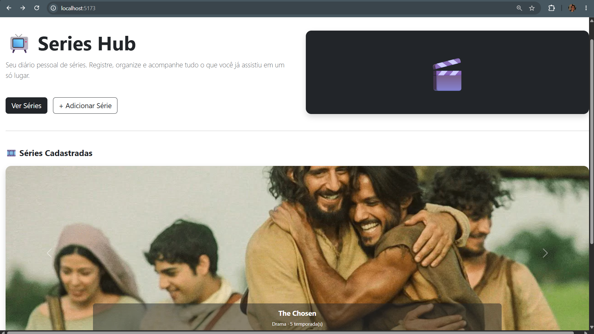
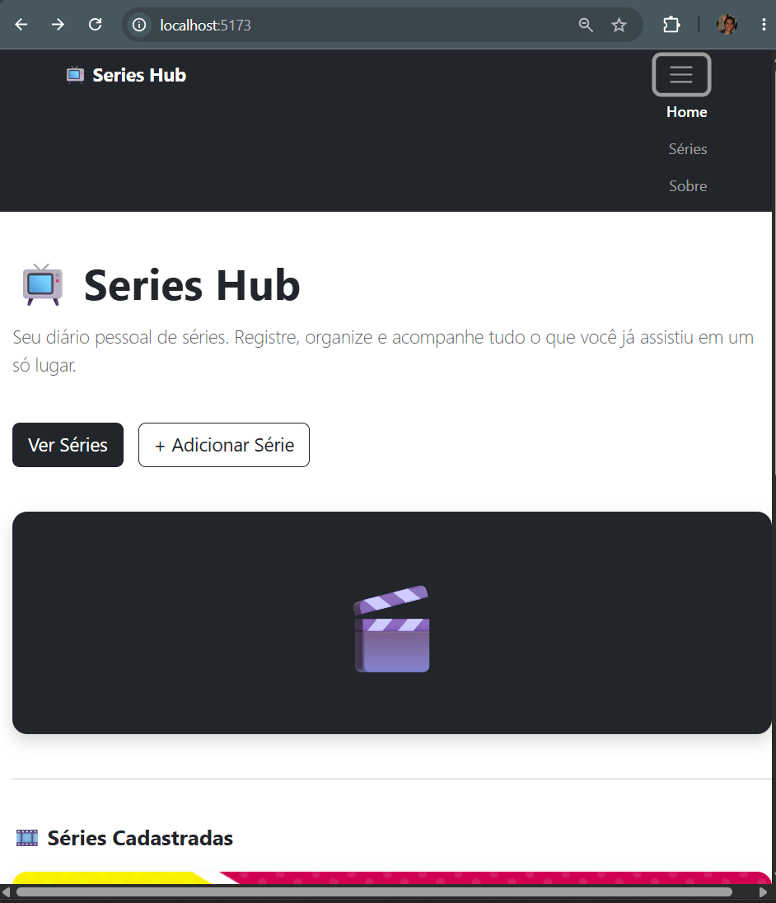
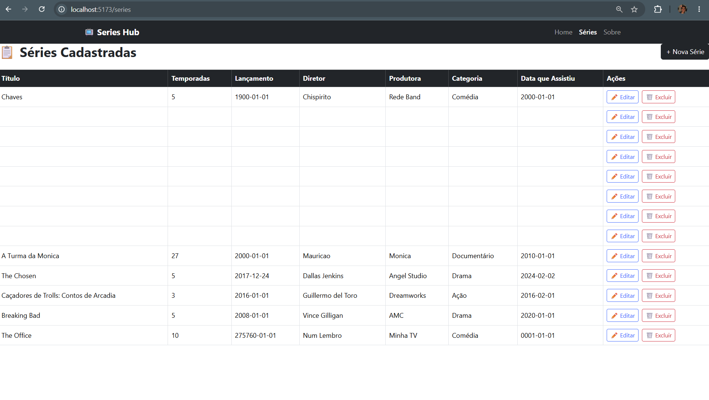
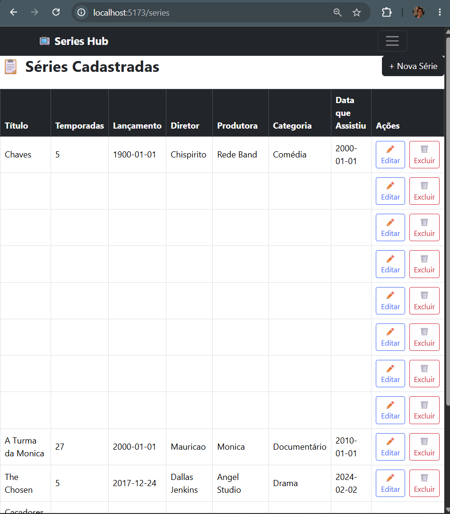
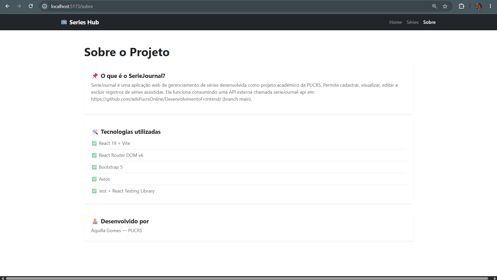
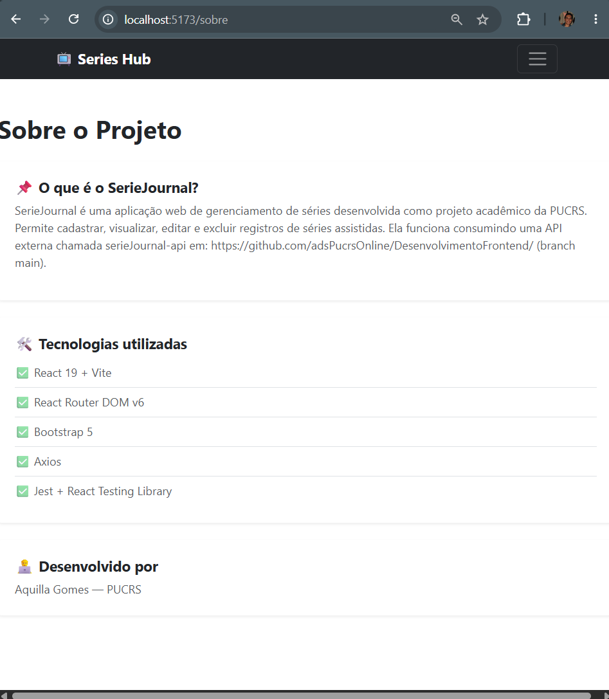
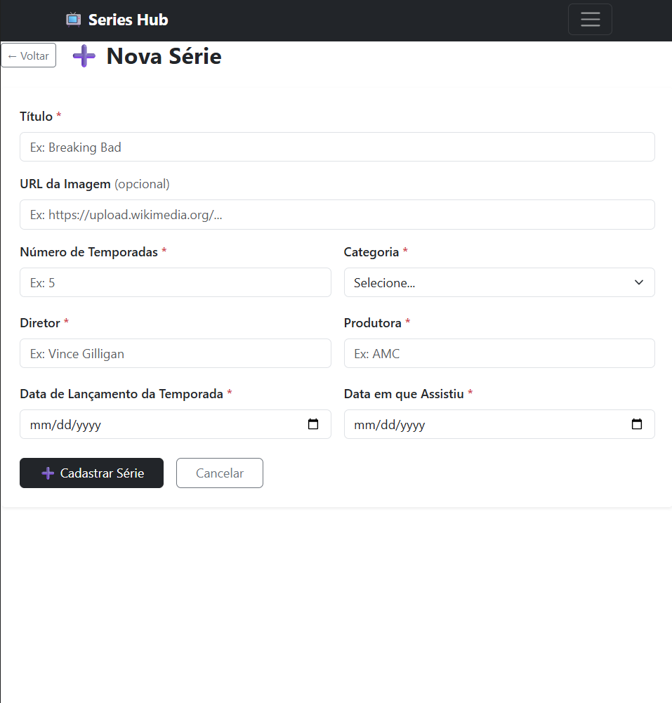
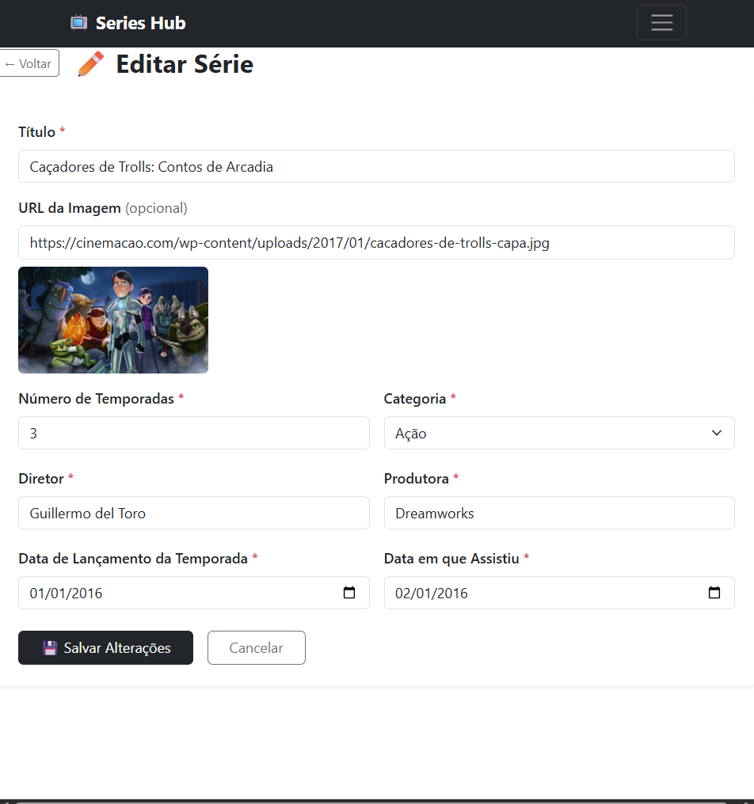

# [🎬 SeriesHub](https://sgomesaquilla.github.io/Series_Hub-sistema-frontend)

## Nome: `Áquilla Siqueira Gomes`

Sistema web desenvolvido em React para gerenciamento de séries, permitindo cadastrar, listar, editar e excluir séries assistidas.

Este projeto foi desenvolvido como parte da disciplina de Sistemas Frontend, e consome a API **serieJournal-api**, disponibilizada pela PUCRS no repositório [DesenvolvimentoFrontend](https://github.com/adsPucrsOnline/DesenvolvimentoFrontend/) (branch `main`). O projeto foi desenvolvido para ser usado em conjunto com essa API — sem ela rodando, as páginas que dependem de dados (Home, Listagem, Formulário) não conseguem carregar ou salvar séries.

---

## 📋 Funcionalidades

* Cadastro de séries
* Listagem de séries cadastradas
* Edição de séries existentes
* Exclusão de séries
* Navegação entre páginas utilizando React Router
* Persistência de dados
* Interface baseada em componentes React

---

## 🛠️ Tecnologias Utilizadas

* React
* Bootstrap
* Vite
* React Router DOM
* Axios

---

## 🚀 Como Executar o Projeto

### Pré-requisitos

* Node.js instalado
* NPM instalado

### Instalação

Clone o repositório ou extraia o arquivo compactado do projeto.

Dentro da pasta series-Hub, instale as dependências:

```bash
cd series-hub
```

```bash
npm install
```

### Executando a API (serieJournal-api)

O frontend depende da API rodando localmente para funcionar de fato. Em um terminal separado:

1. Clone o repositório da API:
   ```bash
   git clone https://github.com/adsPucrsOnline/DesenvolvimentoFrontend.git
   ```
2. Entre na pasta da API:
   ```bash
   cd ./DesenvolvimentoFrontend/serieJournal-api/
   ```
3. Instale as dependências e inicie o servidor:
   ```bash
   npm install
   npm start
   ```

**Rotas disponíveis na API:**

| Método | Rota | Descrição |
|---|---|---|
| GET | `http://localhost:5000/series` | Devolve uma lista de séries |
| GET | `http://localhost:5000/series/:id` | Devolve uma série por id |
| POST | `http://localhost:5000/series` | Cadastra uma nova série |
| PUT | `http://localhost:5000/series` | Atualiza os dados de uma série |
| DELETE | `http://localhost:5000/series/:id` | Remove uma série por id |

### Executando o Frontend

```bash
npm run dev
```

Após iniciar o servidor, acesse:

```txt
http://localhost:5173
```

---

## 🧪 Testes

O projeto conta com testes automatizados escritos com **Jest** e **React Testing Library**. As chamadas de rede são sempre mockadas (via `jest.mock('../api/api')`), por isso **os testes não dependem da API serieJournal-api estar rodando** — eles validam a lógica e a renderização dos componentes de forma isolada e determinística.

### O que é testado

**`Navbar.test.jsx`** — componente
* Renderização da marca "Series Hub"
* Renderização dos links de navegação (Home, Séries, Sobre)
* Verificação se os links apontam para as rotas corretas (`/`, `/series`, `/sobre`)

**`SerieCard.test.jsx`** — componente
* Renderização correta dos dados da série (título, diretor, produtora, categoria)
* Renderização dos botões de ação (Editar e Excluir)
* Chamada da função `onDelete` com o `id` correto ao clicar em "Excluir"

**`Sobre.test.jsx`** — componente
* Renderização do título e dos textos principais da página informativa

**`Formulario.test.jsx`** — componente
* Renderização dos campos obrigatórios em modo de criação
* Envio do formulário chamando `api.post` com os dados corretos
* Carregamento dos dados existentes via `api.get` em modo de edição
* Exibição de mensagem de erro quando a API falha ao salvar

**`Listagem.integration.test.jsx`** — integração
* Testa `Listagem` e `SerieCard` trabalhando juntos (sem mocks entre eles), mockando apenas a API
* Exibição do estado de carregamento e renderização das séries retornadas
* Exibição de mensagem de erro quando a API falha ao carregar
* Exibição do estado vazio quando não há séries cadastradas
* Exclusão de uma série real da lista ao clicar em "Excluir" e confirmar
* Manutenção da série na lista ao cancelar a confirmação de exclusão

### Como executar os testes

Dentro da pasta do projeto, execute:

```bash
npm test
```

Para executar os testes em modo de observação (re-executando automaticamente a cada alteração de código):

```bash
npx jest --watch
```

> Os arquivos de teste estão localizados na pasta `src/tests`, seguindo o padrão de nomenclatura `*.test.jsx`.

---

## 🧩 Componentes do Projeto

### NavBar

Responsável pela navegação principal da aplicação.

Funções:

* Acesso à página inicial
* Acesso à página de cadastro
* Acesso à página de listagem

---

### SerieForm

Componente responsável pelo formulário de cadastro e edição de séries.

Campos disponíveis:

* Título
* Número de Temporadas
* Data de Lançamento
* Diretor
* Produtora
* Categoria
* Data em que assistiu

Também é reutilizado na funcionalidade de edição.

---

### SerieList

Componente responsável pela exibição das séries cadastradas.

Funcionalidades:

* Exibição dos dados da série
* Botão de edição
* Botão de exclusão

---

## 📂 Estrutura do Projeto

```txt
src
│
├── api
│   └── api.js
│
├── components
│   ├── Navbar.jsx
│   └── SerieCard.jsx
│
├── pages
│   ├── Formulario.jsx
│   ├── Home.jsx
│   ├── Listagem.jsx
│   └── Sobre.jsx
│
├── tests
│   ├── Navbar.test.jsx
│   ├── SerieCard.test.jsx
│   ├── Sobre.test.jsx
│   ├── Formulario.test.jsx
│   └── Listagem.integration.test.jsx
│
├── App.jsx
└── main.jsx
```

---

## Telas

Segue abaixo imagens das telas do app na versao desktop e mobile.

### Home




### Series




### Sobre




### Cadastrar/Editar


